# Processed Data EDA Report

Generated at: 2026-04-05 09:58:15 UTC

## 1. Movie Drop 전후 비교

### 전체 요약

| Metric | Value |
| --- | --- |
| Before (movies_processed) | 87,584 |
| After (movies_processed_drop) | 77,647 |
| Dropped | 9,937 |
| Drop ratio | 11.35% |

### Drop 사유별 집계

| Issue | Count | Share of dropped |
| --- | --- | --- |
| missing_genres | 7,080 | 71.25% |
| missing_ratings | 3,153 | 31.73% |
| title_without_year | 616 | 6.20% |

### Issue 조합 (겹침 분석)

| Issue Combination | Count | Share |
| --- | --- | --- |
| missing_genres | 6,206 | 62.45% |
| missing_ratings | 2,614 | 26.31% |
| title_without_year | 229 | 2.30% |
| missing_genres + title_without_year | 349 | 3.51% |
| missing_ratings + missing_genres | 501 | 5.04% |
| missing_ratings + title_without_year | 14 | 0.14% |
| missing_ratings + missing_genres + title_without_year | 24 | 0.24% |

### 주요 지표 변화

| Metric | Before | After |
| --- | --- | --- |
| Total movies | 87,584 | 77,647 |
| Mean ratingAvg | 3.01 | 3.01 |
| Median ratingCount | 5 | 6 |
| Median tagCount | 1 | 2 |

### 장르 분포 비교 (Top 10)

| Genre | Before | After | Dropped |
| --- | --- | --- | --- |
| Drama | 34,174 | 33,076 | 1,098 |
| Comedy | 23,124 | 22,404 | 720 |
| Thriller | 11,822 | 11,518 | 304 |
| Romance | 10,369 | 10,024 | 345 |
| Action | 9,668 | 9,282 | 386 |
| Documentary | 9,363 | 9,041 | 322 |
| Horror | 8,654 | 8,438 | 216 |
| Crime | 6,976 | 6,689 | 287 |
| Adventure | 5,402 | 5,146 | 256 |
| Sci-Fi | 4,907 | 4,777 | 130 |

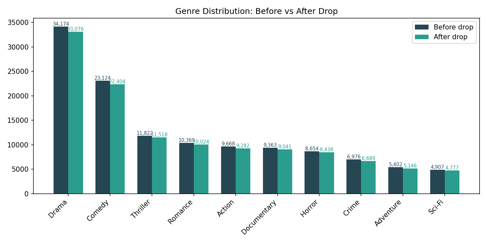

## 2. Dropped Movie 심층 분석

Dropped movie 수: 9,937

### releaseYear 분포: Dropped vs Kept

| Statistic | Dropped | Kept |
| --- | --- | --- |
| min | 1,878 | 1,874 |
| p25 | 1,966 | 1,984 |
| median | 1,993 | 2,006 |
| p75 | 2,011 | 2,016 |
| p90 | 2,017 | 2,019 |
| p99 | 2,021 | 2,023 |
| max | 2,023 | 2,023 |
| mean | 1,986 | 1,997 |

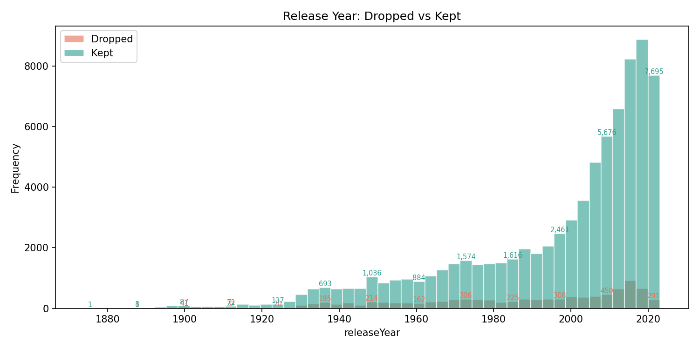

### ratingCount 분포: Dropped vs Kept

| Statistic | Dropped | Kept |
| --- | --- | --- |
| min | 0 | 1 |
| p25 | 0 | 2 |
| median | 1 | 6 |
| p75 | 3 | 30 |
| p90 | 7 | 300 |
| p99 | 64 | 9,928 |
| max | 5,971 | 102,929 |
| mean | 8 | 411 |

Dropped movie 중 ratingCount == 0: 3,153 (31.73%)

### ratingAvg 분포: Dropped vs Kept

| Statistic | Dropped | Kept |
| --- | --- | --- |
| min | 0.50 | 0.50 |
| p25 | 2.50 | 2.57 |
| median | 3.00 | 3.08 |
| p75 | 3.50 | 3.50 |
| p90 | 4.00 | 3.85 |
| p99 | 5.00 | 5.00 |
| max | 5.00 | 5.00 |
| mean | 2.98 | 3.01 |

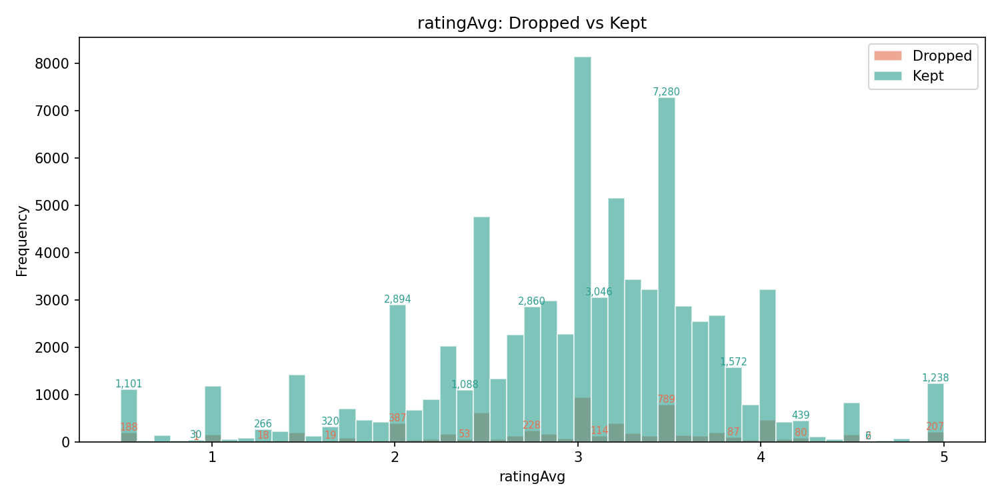

### tagCount 분포: Dropped vs Kept

| Statistic | Dropped | Kept |
| --- | --- | --- |
| min | 0 | 0 |
| p25 | 0 | 0 |
| median | 1 | 2 |
| p75 | 3 | 8 |
| p90 | 6 | 25 |
| p99 | 46 | 260 |
| max | 463 | 1,109 |
| mean | 3 | 14 |

Dropped movie 중 tagCount == 0: 4,544 (45.73%)

### 장르별 Drop Rate

| Genre | Total | Dropped | Drop Rate |
| --- | --- | --- | --- |
| Drama | 34,174 | 1,098 | 3.21% |
| Comedy | 23,124 | 720 | 3.11% |
| Thriller | 11,822 | 304 | 2.57% |
| Romance | 10,369 | 345 | 3.33% |
| Action | 9,668 | 386 | 3.99% |
| Documentary | 9,363 | 322 | 3.44% |
| Horror | 8,654 | 216 | 2.50% |
| Crime | 6,976 | 287 | 4.11% |
| Adventure | 5,402 | 256 | 4.74% |
| Sci-Fi | 4,907 | 130 | 2.65% |
| Animation | 4,617 | 36 | 0.78% |
| Children | 4,520 | 81 | 1.79% |
| Mystery | 4,013 | 127 | 3.16% |
| Fantasy | 3,851 | 78 | 2.03% |
| War | 2,325 | 100 | 4.30% |

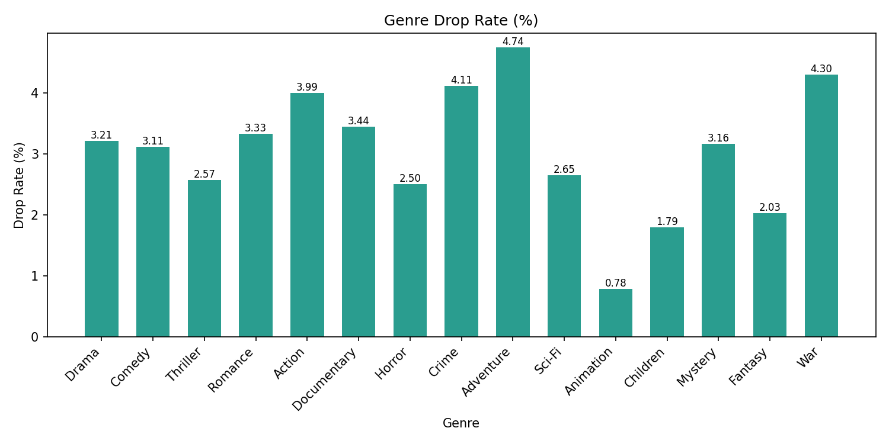

### Issue 단일 vs 복합 사유

| Type | Count | Share |
| --- | --- | --- |
| 단일 사유 | 9,049 | 91.06% |
| 복합 사유 (2개 이상) | 888 | 8.94% |

## 3. 최종 Rating 데이터 종합 분석

### 기본 프로파일

| Metric | Value |
| --- | --- |
| Total ratings | 31,916,363 |
| Unique users | 200,948 |
| Unique movies | 77,647 |
| Mean rating | 3.54 |
| Median rating | 3.50 |
| First ratedAt | 1995-01-09T11:46:44Z |
| Last ratedAt | 2023-10-13T02:29:07Z |

### Sparsity 분석

| Metric | Value |
| --- | --- |
| User-Item matrix size | 200,948 x 77,647 = 15,603,009,356 |
| Observed interactions | 31,916,363 |
| Density | 0.204553% |
| Sparsity | 99.7954% |

### Rating 값 분포

| Rating | Count | Share |
| --- | --- | --- |
| 0.5 | 522,296 | 1.64% |
| 1.0 | 944,284 | 2.96% |
| 1.5 | 528,859 | 1.66% |
| 2.0 | 2,023,844 | 6.34% |
| 2.5 | 1,678,777 | 5.26% |
| 3.0 | 6,041,612 | 18.93% |
| 3.5 | 4,275,170 | 13.39% |
| 4.0 | 8,350,164 | 26.16% |
| 4.5 | 2,964,625 | 9.29% |
| 5.0 | 4,586,732 | 14.37% |

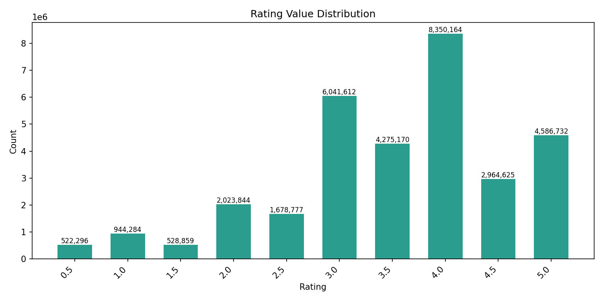

### 연도별 Rating 트렌드

| Year | Ratings | Cumulative % |
| --- | --- | --- |
| 1995 | 4 | 0.0% |
| 1996 | 1,571,368 | 4.9% |
| 1997 | 685,388 | 7.1% |
| 1998 | 301,691 | 8.0% |
| 1999 | 1,174,629 | 11.7% |
| 2000 | 1,912,322 | 17.7% |
| 2001 | 1,160,098 | 21.3% |
| 2002 | 849,762 | 24.0% |
| 2003 | 1,011,000 | 27.2% |
| 2004 | 1,139,068 | 30.7% |
| 2005 | 1,752,573 | 36.2% |
| 2006 | 1,141,704 | 39.8% |
| 2007 | 1,023,813 | 43.0% |
| 2008 | 1,117,071 | 46.5% |
| 2009 | 890,696 | 49.3% |
| 2010 | 860,070 | 52.0% |
| 2011 | 729,295 | 54.3% |
| 2012 | 695,487 | 56.4% |
| 2013 | 563,300 | 58.2% |
| 2014 | 518,512 | 59.8% |
| 2015 | 1,742,276 | 65.3% |
| 2016 | 1,914,976 | 71.3% |
| 2017 | 1,819,673 | 77.0% |
| 2018 | 1,380,822 | 81.3% |
| 2019 | 1,371,567 | 85.6% |
| 2020 | 1,673,079 | 90.9% |
| 2021 | 1,227,824 | 94.7% |
| 2022 | 902,572 | 97.5% |
| 2023 | 785,723 | 100.0% |

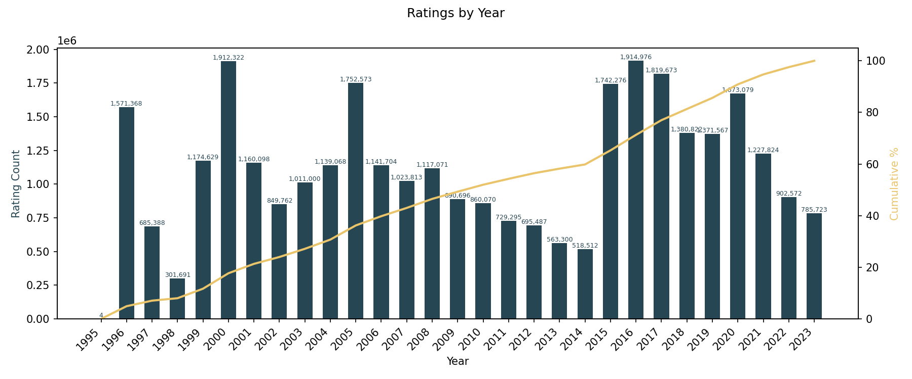

### Interaction Density

#### User당 rating 수

| Statistic | Ratings per user |
| --- | --- |
| min | 17 |
| p25 | 36 |
| median | 72 |
| p75 | 166 |
| p90 | 363 |
| p99 | 1,286 |
| max | 31,234 |
| mean | 159 |

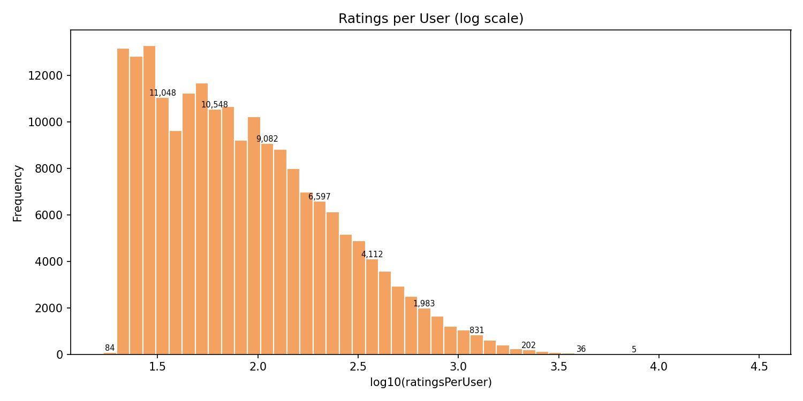

#### Movie당 rating 수

| Statistic | Ratings per movie |
| --- | --- |
| min | 1 |
| p25 | 2 |
| median | 6 |
| p75 | 30 |
| p90 | 300 |
| p99 | 9,928 |
| max | 102,929 |
| mean | 411 |

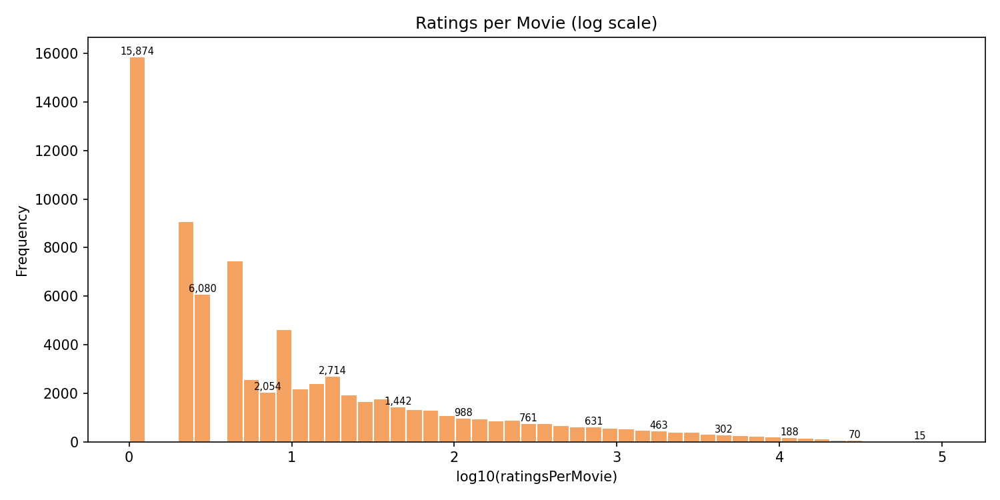

### Long-tail & Popularity Bias

#### Movie Threshold Coverage

| Min ratings | Movies | Movies % | Interactions | Interactions % |
| --- | --- | --- | --- | --- |
| >= 1 | 77,647 | 100.00% | 31,916,363 | 100.00% |
| >= 5 | 42,341 | 54.53% | 31,847,015 | 99.78% |
| >= 10 | 31,261 | 40.26% | 31,773,719 | 99.55% |
| >= 20 | 23,052 | 29.69% | 31,662,286 | 99.20% |
| >= 50 | 15,915 | 20.50% | 31,440,356 | 98.51% |
| >= 100 | 12,118 | 15.61% | 31,173,648 | 97.67% |
| >= 500 | 6,202 | 7.99% | 29,789,223 | 93.34% |
| >= 1000 | 4,382 | 5.64% | 28,489,156 | 89.26% |

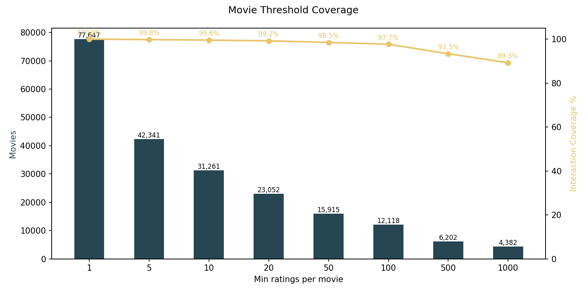

#### User Threshold Coverage

| Min ratings | Users | Users % | Interactions | Interactions % |
| --- | --- | --- | --- | --- |
| >= 20 | 200,864 | 99.96% | 31,914,778 | 100.00% |
| >= 50 | 128,246 | 63.82% | 29,617,285 | 92.80% |
| >= 100 | 80,575 | 40.10% | 26,262,827 | 82.29% |
| >= 200 | 42,109 | 20.96% | 20,905,570 | 65.50% |
| >= 500 | 12,562 | 6.25% | 11,857,630 | 37.15% |
| >= 1000 | 3,598 | 1.79% | 5,781,495 | 18.11% |

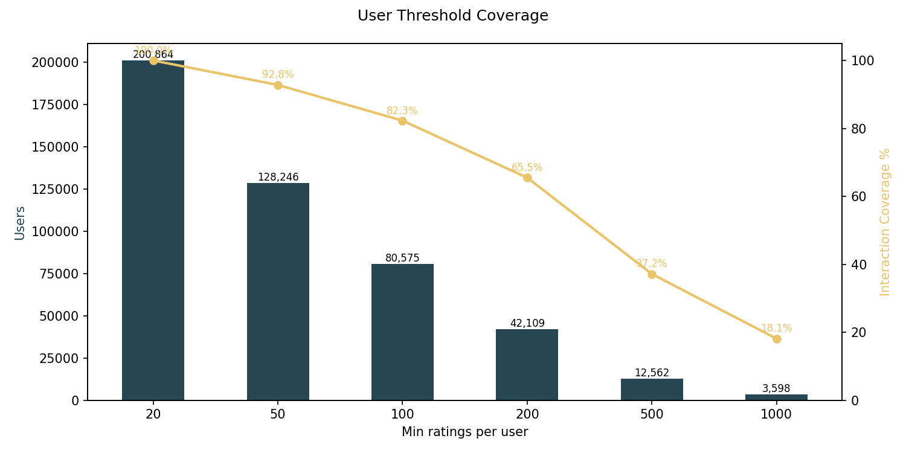

#### Concentration (Head Dominance)

| Fraction | Movie: top N | Movie: interaction share | User: top N | User: interaction share |
| --- | --- | --- | --- | --- |
| Top 1% | 777 | 52.98% | 2,010 | 12.51% |
| Top 5% | 3,883 | 87.51% | 10,048 | 32.96% |
| Top 10% | 7,765 | 95.25% | 20,095 | 47.14% |

#### Gini Coefficient

| Dimension | Gini |
| --- | --- |
| Movie (rating count) | 0.9496 |
| User (rating count) | 0.5932 |

(0 = 완전 균등, 1 = 완전 집중. 추천 시스템에서는 0.8 이상이면 극심한 long-tail)

### Cold-start 프로파일

#### Movie Cold-start

| Condition | Movies | Share |
| --- | --- | --- |
| < 5 ratings | 35,306 | 45.47% |
| < 10 ratings | 46,386 | 59.74% |
| < 20 ratings | 54,595 | 70.31% |

#### User Cold-start

| Condition | Users | Share |
| --- | --- | --- |
| < 20 ratings | 84 | 0.04% |
| < 50 ratings | 72,702 | 36.18% |

### User Sequence 분석

#### Sequence Output Summary

| Metric | Value |
| --- | --- |
| JSONL lines | 200,948 |
| users_output | 200,948 |
| rating_count_sum | 31,916,363 |
| invalid_rows | 0 |
| Min ratingCount/user | 17 |
| Max ratingCount/user | 31,234 |

Line count == users_output: OK

#### Sequence 길이 분포

| Statistic | Sequence length |
| --- | --- |
| min | 17 |
| p25 | 36 |
| median | 72 |
| p75 | 166 |
| p90 | 363 |
| p99 | 1,286 |
| max | 31,234 |
| mean | 159 |

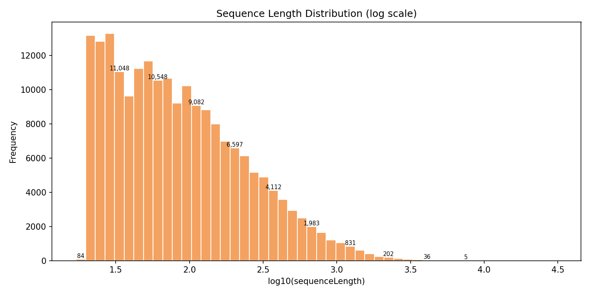

#### Activity Span 분포

| Statistic | Active span (days) |
| --- | --- |
| min | 0.00 |
| p25 | 0.01 |
| median | 0.07 |
| p75 | 53.04 |
| p90 | 707.80 |
| p99 | 4431.31 |
| max | 9515.14 |
| mean | 258.99 |

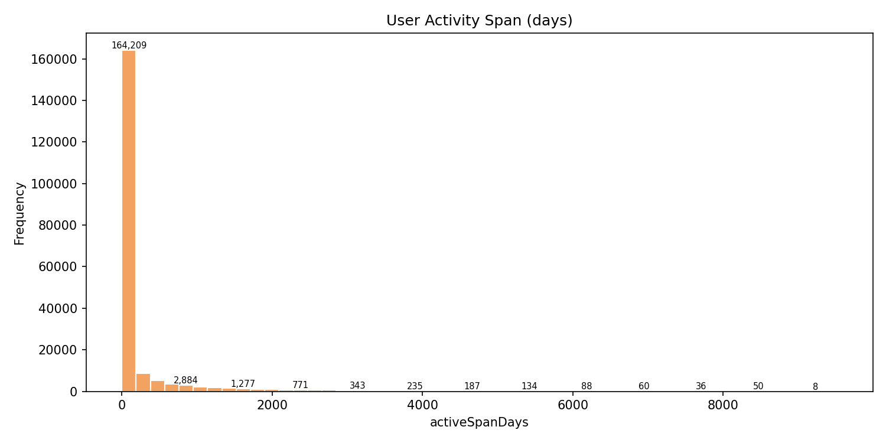

#### Activity Span Buckets

| Bucket | Users | Share |
| --- | --- | --- |
| <=0.1d | 104,544 | 52.03% |
| 0.1-1d | 13,601 | 6.77% |
| 1-7d | 15,339 | 7.63% |
| 7-30d | 12,236 | 6.09% |
| 30-365d | 26,666 | 13.27% |
| >365d | 28,562 | 14.21% |

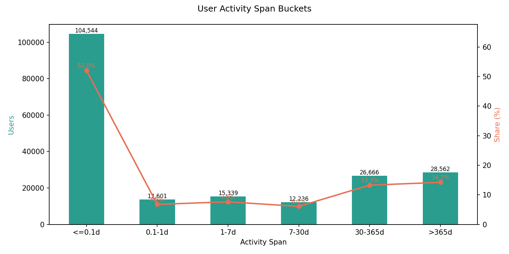

#### Notable Users

| Observation | Value |
| --- | --- |
| Longest history userId | 175,325 |
| Longest history ratingCount | 31,234 |
| Longest active-span userId | 76,854 |
| Longest active-span days | 9515.14 |
