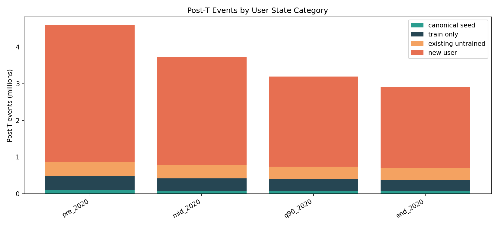
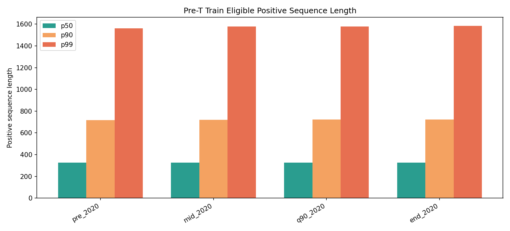
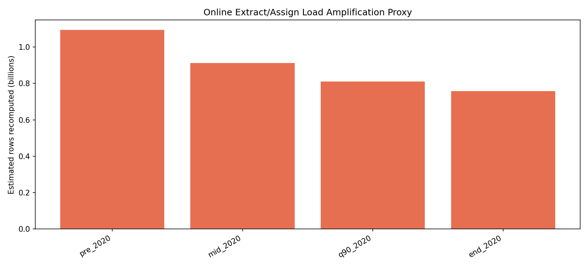

# Temporal Cutoff 2020 Pipeline Deep Dive

Generated at: 2026-05-15T01:30:43Z

## 파이프라인 기준

| Stage | 현재 기준 | 이 EDA에서 보는 값 |
| --- | --- | --- |
| batch train | z-score positive, min interactions 200, activity 30d | train eligible user, pre-T positive sequence length, training window sample |
| canonical extract | min interactions 1000 | 초기 interest state를 만들 수 있는 canonical seed user |
| item2idx | train eligible positive movie만 포함 | post-T known/unknown item event share |
| online extract | event마다 해당 user active positive 전체 embedding 재계산 | online recompute rows proxy |
| interest/refit | refit_min 20, assign_trigger 50, outlier 10 | seeded/no-seed refit candidate user와 refit cluster row |

## 후보별 요약

| T | Pre raw | Post raw | Train users | Canonical users | Item vocab | Train seq p50/p90/p99 | Known post item | Post events to canonical | Online rows/event | Refit users |
| --- | --- | --- | --- | --- | --- | --- | --- | --- | --- | --- |
| pre_2020 2019-12-31T23:59:59Z | 27,327,165 | 4,589,198 | 12,650 | 508 | 40,973 | 326/717/1,562 | 92.65% | 2.16% | 238 | seeded 94, no-seed 22,320 |
| mid_2020 2020-06-30T23:59:59Z | 28,197,848 | 3,718,515 | 13,021 | 531 | 43,151 | 327/721/1,578 | 92.25% | 2.34% | 245 | seeded 86, no-seed 18,063 |
| q90_2020 2020-10-29T23:59:59Z | 28,725,447 | 3,190,916 | 13,273 | 545 | 44,342 | 327/724/1,577 | 92.34% | 2.52% | 254 | seeded 78, no-seed 15,605 |
| end_2020 2020-12-31T23:59:59Z | 29,000,244 | 2,916,119 | 13,389 | 555 | 45,123 | 327/724/1,584 | 92.37% | 2.58% | 260 | seeded 74, no-seed 14,242 |

## User/Sequence 해석

| T | Train windows | Post user events p50/p90/p99/max | Final active known seq p50/p90/p99/max | Post known positive proxy |
| --- | --- | --- | --- | --- |
| pre_2020 | 87,160 | 74/359/1,274/6,355 | 65/365/1,148/12,104 | 2,149,712 (46.84%) |
| mid_2020 | 90,211 | 69/339/1,241/6,355 | 69/394/1,191/4,520 | 1,719,478 (46.24%) |
| q90_2020 | 92,090 | 65/326/1,200/6,355 | 72/413/1,246/4,567 | 1,470,359 (46.08%) |
| end_2020 | 93,116 | 63/318/1,181/6,355 | 75/426/1,277/4,601 | 1,334,939 (45.78%) |

## Post-T 이벤트가 들어가는 위치

| T | Canonical seed | Train only | Existing untrained | New user | Unknown item events | Hourly p99/max |
| --- | --- | --- | --- | --- | --- | --- |
| pre_2020 | 98,947 (2.16%) | 382,086 (8.33%) | 382,031 (8.32%) | 3,726,134 (81.19%) | 337,404 (7.35%) | 790/5,817 |
| mid_2020 | 87,103 (2.34%) | 337,618 (9.08%) | 358,337 (9.64%) | 2,935,457 (78.94%) | 288,199 (7.75%) | 742/5,817 |
| q90_2020 | 80,303 (2.52%) | 317,086 (9.94%) | 342,143 (10.72%) | 2,451,384 (76.82%) | 244,377 (7.66%) | 723/5,817 |
| end_2020 | 75,101 (2.58%) | 302,821 (10.38%) | 323,976 (11.11%) | 2,214,221 (75.93%) | 222,582 (7.63%) | 698/5,817 |

## 결론

- 2020 전후 cutoff는 `T`가 늦어질수록 train/canonical user와 item vocab은 늘지만, post-T 부하 관찰량은 줄어든다.
- 현재 replay stage는 event 하나당 새 event 하나만 처리하는 구조가 아니라, 해당 user의 active known positive sequence를 반복 재계산/재스캔한다.
- 따라서 post raw event 수보다 `online rows/event`와 `final active known sequence length`가 실제 CPU/GPU/IO 부하를 더 잘 설명한다.
- 초기 interest state를 canonical user에만 seed한다면, post-T 이벤트의 상당 부분은 no-interest 상태로 들어오므로 refit pressure가 커진다.
- 다음 구현에서는 train cutoff, canonical cutoff, state seed cutoff를 같은 `T`로 묶고, canonical min interactions를 train과 맞출지 별도 결정해야 한다.

