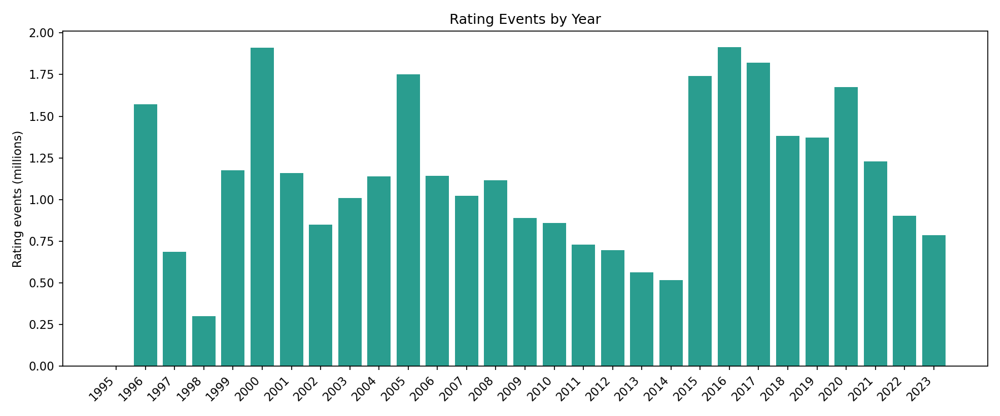
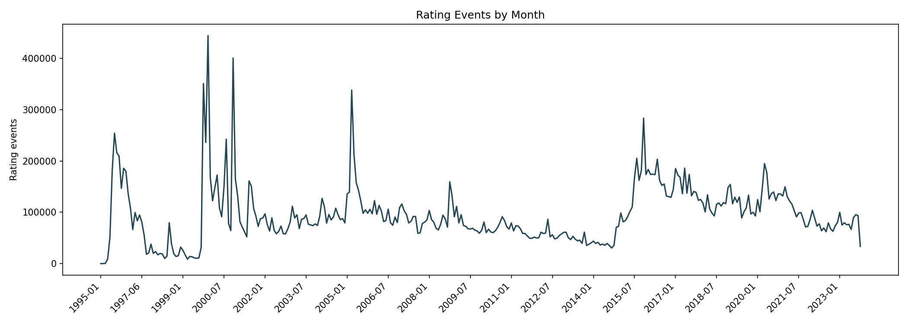
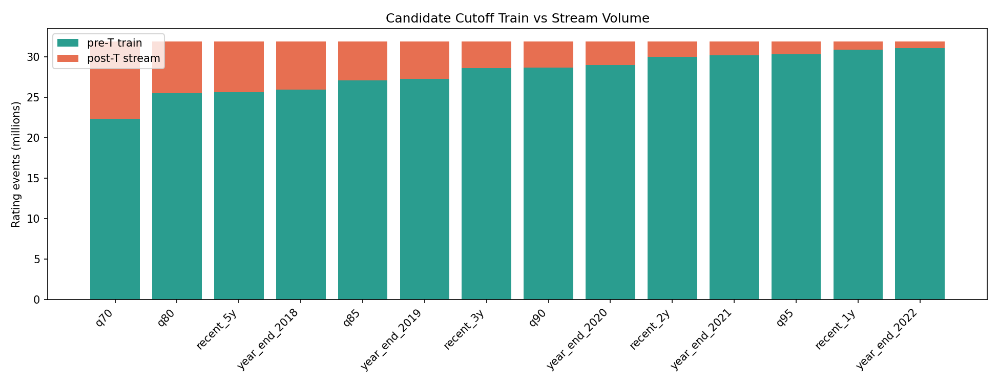
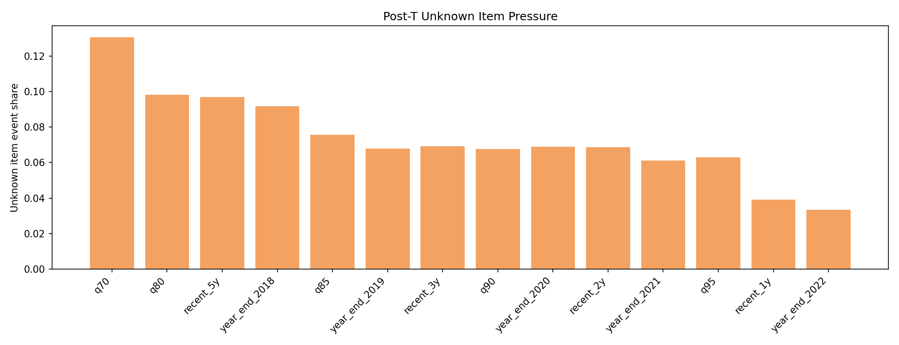
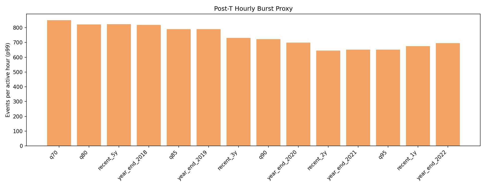

# Temporal Cutoff T Candidate EDA

Generated at: 2026-05-15T01:13:48Z

## 목적

`T` 이전 데이터로 offline model/state를 만들고 `T` 이후 데이터를 streaming replay로 흘릴 때, 어느 cutoff가 학습량과 stream 부하 관찰량의 균형이 좋은지 판단하기 위한 EDA다.

## 입력

| Item | Value |
| --- | --- |
| ratings | data/ratings_drop.csv |
| positive proxy | rating >= 4 |
| refit_min_events | 3 |
| assign_trigger_count | 3 |
| outlier_trigger_count | 3 |

## 전체 프로파일

| Metric | Value |
| --- | --- |
| Total rating events | 31,916,363 |
| Unique users | 200,948 |
| Unique movies | 77,647 |
| Mean rating | 3.54 |
| First ratedAt | 1995-01-09T11:46:44Z |
| Last ratedAt | 2023-10-13T02:29:07Z |

## 연도별 이벤트

| Year | Events | Cumulative |
| --- | --- | --- |
| 1995 | 4 | 0.00% |
| 1996 | 1,571,368 | 4.92% |
| 1997 | 685,388 | 7.07% |
| 1998 | 301,691 | 8.02% |
| 1999 | 1,174,629 | 11.70% |
| 2000 | 1,912,322 | 17.69% |
| 2001 | 1,160,098 | 21.32% |
| 2002 | 849,762 | 23.99% |
| 2003 | 1,011,000 | 27.15% |
| 2004 | 1,139,068 | 30.72% |
| 2005 | 1,752,573 | 36.21% |
| 2006 | 1,141,704 | 39.79% |
| 2007 | 1,023,813 | 43.00% |
| 2008 | 1,117,071 | 46.50% |
| 2009 | 890,696 | 49.29% |
| 2010 | 860,070 | 51.98% |
| 2011 | 729,295 | 54.27% |
| 2012 | 695,487 | 56.45% |
| 2013 | 563,300 | 58.21% |
| 2014 | 518,512 | 59.84% |
| 2015 | 1,742,276 | 65.30% |
| 2016 | 1,914,976 | 71.30% |
| 2017 | 1,819,673 | 77.00% |
| 2018 | 1,380,822 | 81.32% |
| 2019 | 1,371,567 | 85.62% |
| 2020 | 1,673,079 | 90.86% |
| 2021 | 1,227,824 | 94.71% |
| 2022 | 902,572 | 97.54% |
| 2023 | 785,723 | 100.00% |

## 후보별 핵심 비교

| Candidate | Cutoff T | Pre events | Post events | Post days | Avg/day | Hour p99 | Post users | New users | Unknown item events | Positive proxy | Role |
| --- | --- | --- | --- | --- | --- | --- | --- | --- | --- | --- | --- |
| q70 | 2016-09-28T23:59:59Z | 22,341,851 (70.00%) | 9,574,512 (30.00%) | 2,571 | 3,724 | 851 | 54,581 | 46,634 (85.44%) | 1,250,025 (13.06%) | 4,744,739 (49.56%) |  |
| q80 | 2018-09-20T23:59:59Z | 25,534,958 (80.01%) | 6,381,405 (19.99%) | 1,849 | 3,451 | 823 | 38,488 | 30,685 (79.73%) | 626,412 (9.82%) | 3,172,443 (49.71%) |  |
| recent_5y | 2018-10-14T23:59:59Z | 25,624,895 (80.29%) | 6,291,468 (19.71%) | 1,825 | 3,447 | 824 | 38,027 | 30,205 (79.43%) | 609,218 (9.68%) | 3,127,446 (49.71%) | stress |
| year_end_2018 | 2018-12-31T23:59:59Z | 25,955,598 (81.32%) | 5,960,765 (18.68%) | 1,747 | 3,412 | 820 | 36,254 | 28,379 (78.28%) | 546,204 (9.16%) | 2,956,129 (49.59%) |  |
| q85 | 2019-10-29T23:59:59Z | 27,129,684 (85.00%) | 4,786,679 (15.00%) | 1,445 | 3,313 | 790 | 30,322 | 22,487 (74.16%) | 362,396 (7.57%) | 2,369,661 (49.51%) | balanced |
| year_end_2019 | 2019-12-31T23:59:59Z | 27,327,165 (85.62%) | 4,589,198 (14.38%) | 1,382 | 3,321 | 790 | 29,341 | 21,529 (73.38%) | 311,271 (6.78%) | 2,272,882 (49.53%) |  |
| recent_3y | 2020-10-13T23:59:59Z | 28,649,990 (89.77%) | 3,266,373 (10.23%) | 1,095 | 2,983 | 731 | 22,741 | 14,770 (64.95%) | 225,948 (6.92%) | 1,596,554 (48.88%) |  |
| q90 | 2020-10-29T23:59:59Z | 28,725,447 (90.00%) | 3,190,916 (10.00%) | 1,079 | 2,957 | 723 | 22,390 | 14,391 (64.27%) | 215,722 (6.76%) | 1,559,759 (48.88%) | conservative |
| year_end_2020 | 2020-12-31T23:59:59Z | 29,000,244 (90.86%) | 2,916,119 (9.14%) | 1,016 | 2,870 | 698 | 20,964 | 12,998 (62.00%) | 201,143 (6.90%) | 1,415,599 (48.54%) |  |
| recent_2y | 2021-10-13T23:59:59Z | 30,027,950 (94.08%) | 1,888,413 (5.92%) | 730 | 2,587 | 645 | 15,439 | 8,189 (53.04%) | 129,677 (6.87%) | 900,995 (47.71%) |  |
| year_end_2021 | 2021-12-31T23:59:59Z | 30,228,068 (94.71%) | 1,688,295 (5.29%) | 651 | 2,593 | 652 | 14,294 | 7,331 (51.29%) | 103,199 (6.11%) | 805,969 (47.74%) |  |
| q95 | 2022-01-24T23:59:59Z | 30,321,581 (95.00%) | 1,594,782 (5.00%) | 627 | 2,544 | 652 | 13,761 | 6,930 (50.36%) | 100,224 (6.28%) | 763,589 (47.88%) |  |
| recent_1y | 2022-10-13T23:59:59Z | 30,939,786 (96.94%) | 976,577 (3.06%) | 365 | 2,676 | 676 | 10,071 | 4,261 (42.31%) | 38,180 (3.91%) | 474,162 (48.55%) |  |
| year_end_2022 | 2022-12-31T23:59:59Z | 31,130,640 (97.54%) | 785,723 (2.46%) | 286 | 2,747 | 696 | 8,840 | 3,419 (38.68%) | 26,173 (3.33%) | 383,405 (48.80%) |  |

## 추천 후보

| Role | Candidate | Cutoff T | Why |
| --- | --- | --- | --- |
| stress | recent_5y | 2018-10-14T23:59:59Z | pre 80.29%, post 6,291,468 events, 3,447/day, unknown item 9.68% |
| balanced | q85 | 2019-10-29T23:59:59Z | pre 85.00%, post 4,786,679 events, 3,313/day, unknown item 7.57% |
| conservative | q90 | 2020-10-29T23:59:59Z | pre 90.00%, post 3,190,916 events, 2,957/day, unknown item 6.76% |

## 해석 기준

- `positive proxy`는 실제 streaming z-score positive projection이 아니라 `rating >= threshold` 근사다.
- `unknown item events`는 post-`T` event 중 pre-`T` item vocabulary에 없을 movie event 압력이다.
- `Hour p99`는 post-`T` active hour 기준 burst proxy다. 실제 replay 부하는 `--speed`와 stage latency에 의해 결정된다.
- `new users`가 높을수록 pre-`T` user state seed 없이 시작하는 user가 많다.

## 후속 구현 필요 항목

- `model.batch.train` 또는 dataset loader에 `--max-rated-at` 계열 cutoff option 추가
- canonical extract / batch cluster / state seed가 같은 `T`와 output root를 공유하도록 run layout 정의
- replay input 생성기에 `--min-rated-at-exclusive` 또는 `--after-rated-at` option 추가
- SQLite runtime store에서 post-`T` load profile query/report를 뽑는 helper 추가

