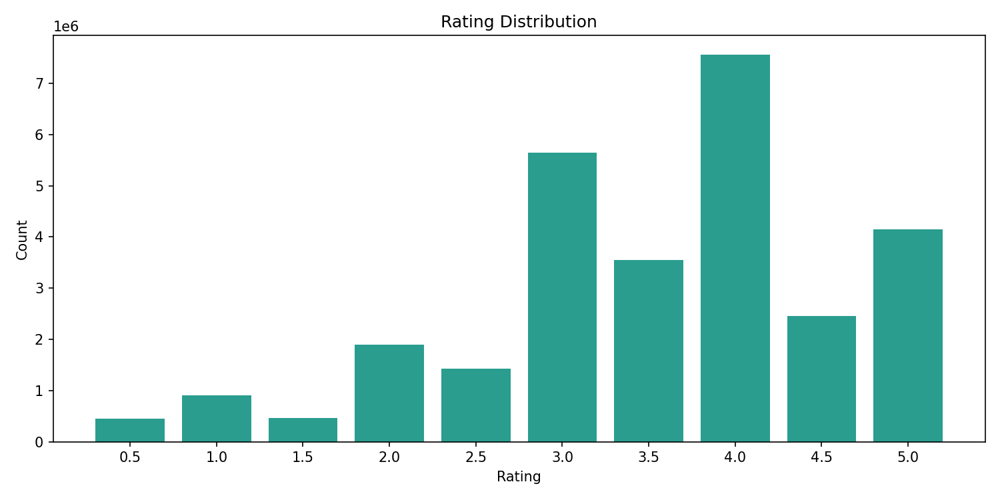
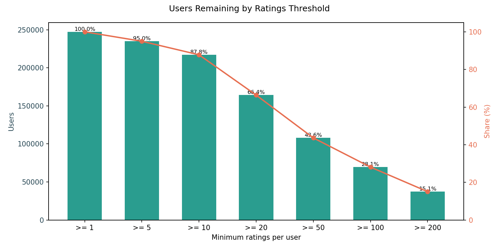
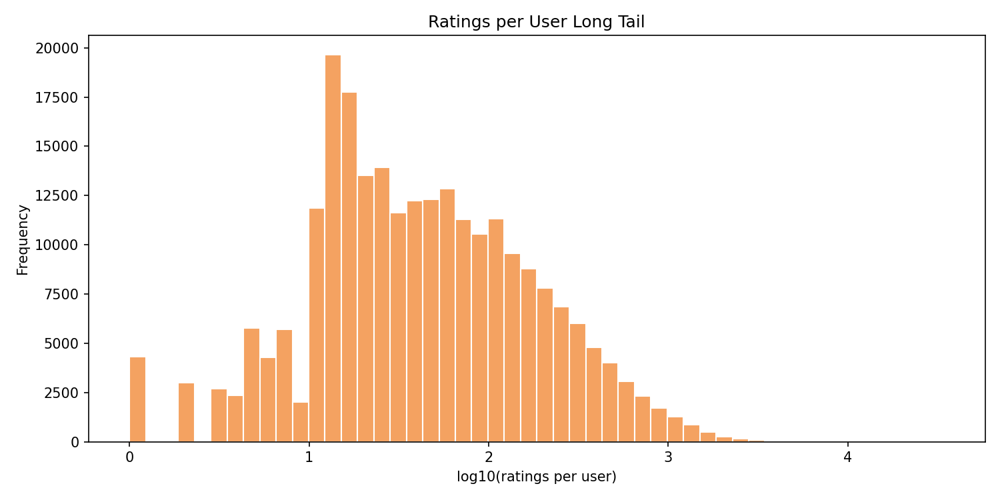
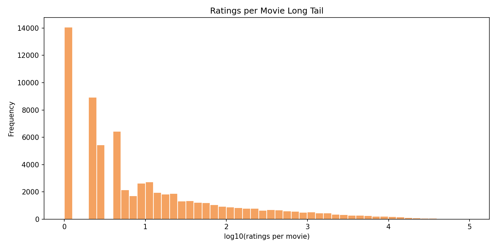
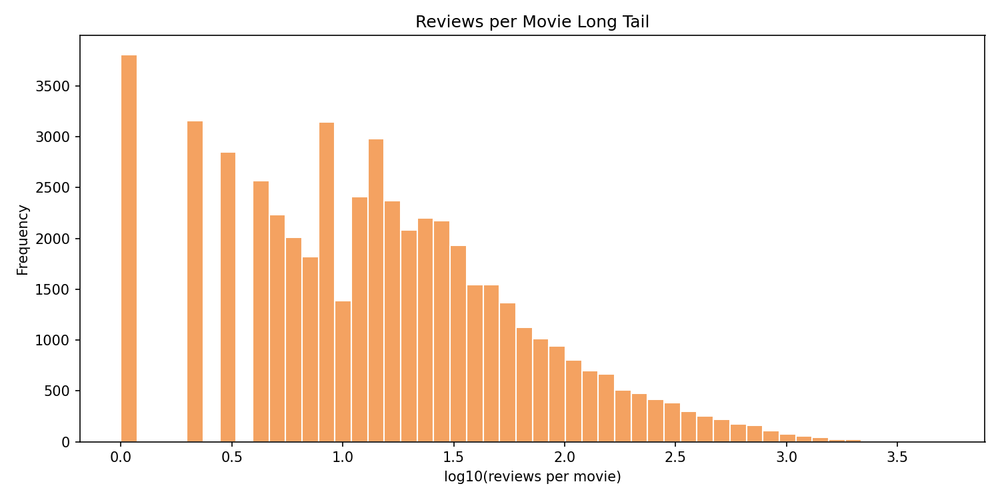
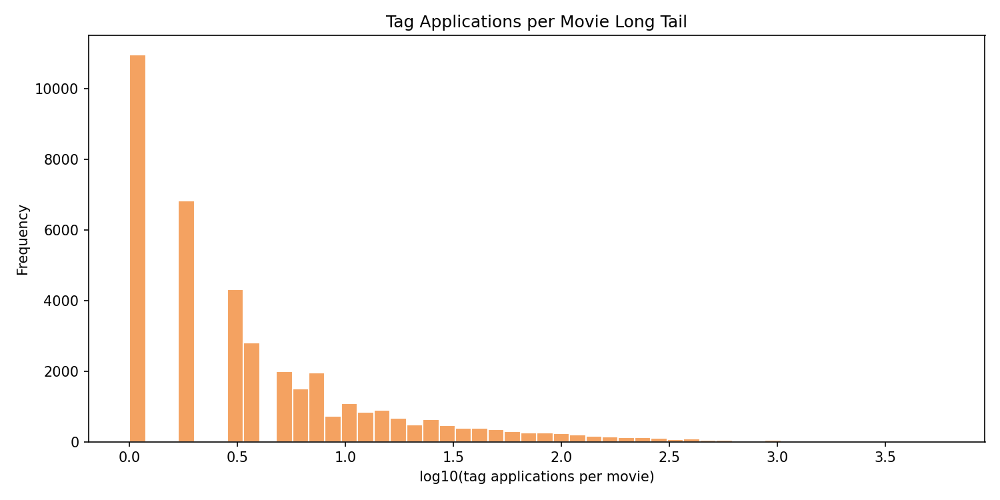
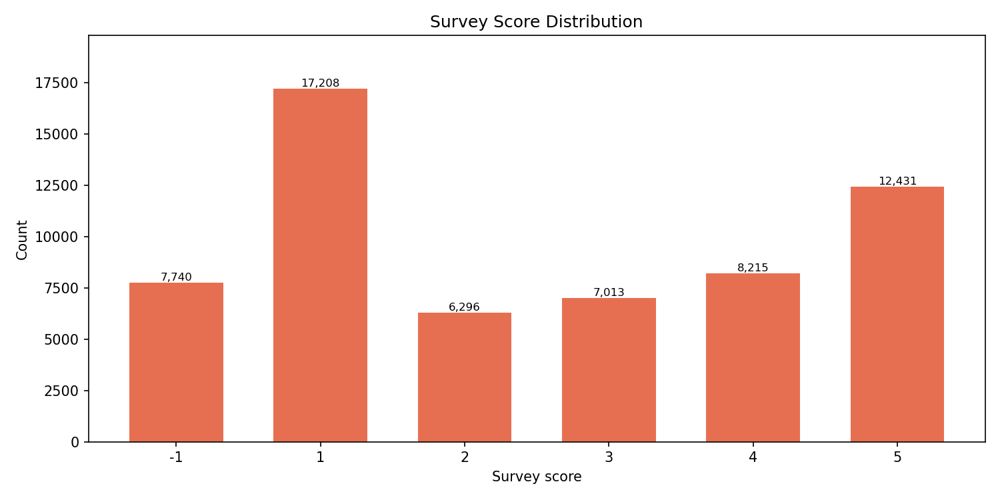

# Genome 2021 Movie Dataset EDA Report

Generated at: 2026-03-27 12:44:40

## Dataset Overview

| Metric | Value |
| --- | --- |
| Metadata movies | 84,661 |
| Ratings | 28,490,116 |
| Users with ratings | 247,383 |
| Movies with ratings | 67,873 |
| Reviews | 2,624,608 |
| Movies with reviews | 52,081 |
| Tag vocabulary | 1,094 |
| Movie-tag count pairs | 212,704 |
| Total tag applications | 832,896 |
| Movies with tag counts | 39,685 |
| Survey answers | 58,903 |
| Survey users | 679 |
| Survey movies | 5,546 |
| Survey tags | 1,094 |
| GLMER score rows | 10,551,655 |
| TagDL score rows | 10,551,655 |

## Metadata Quality

| Check | Value |
| --- | --- |
| Titles without year pattern | 669 |
| Missing directors | 3,150 |
| Missing starring cast | 6,883 |
| Missing dateAdded | 6,518 |
| Missing avgRating | 0 |
| Missing imdbId | 0 |
| Metadata movies without ratings | 16,788 |
| Metadata movies without reviews | 32,580 |
| Metadata movies without tag counts | 44,976 |

## Ratings

| Rating | Count | Share |
| --- | --- | --- |
| 0.5 | 452,497 | 1.59% |
| 1.0 | 903,188 | 3.17% |
| 1.5 | 459,396 | 1.61% |
| 2.0 | 1,893,423 | 6.65% |
| 2.5 | 1,431,136 | 5.02% |
| 3.0 | 5,642,345 | 19.80% |
| 3.5 | 3,547,626 | 12.45% |
| 4.0 | 7,561,486 | 26.54% |
| 4.5 | 2,450,560 | 8.60% |
| 5.0 | 4,148,459 | 14.56% |

| Statistic | Ratings per user |
| --- | --- |
| min | 1 |
| p25 | 16 |
| median | 38 |
| p75 | 114 |
| p90 | 286 |
| p99 | 1,114 |
| max | 34,397 |
| mean | 115 |

| Threshold | Users | Share |
| --- | --- | --- |
| >= 1 ratings | 247,383 | 100.00% |
| >= 5 ratings | 234,981 | 94.99% |
| >= 10 ratings | 217,193 | 87.80% |
| >= 20 ratings | 164,204 | 66.38% |
| >= 50 ratings | 107,920 | 43.62% |
| >= 100 ratings | 69,555 | 28.12% |
| >= 200 ratings | 37,257 | 15.06% |

| Statistic | Ratings per movie |
| --- | --- |
| min | 1 |
| p25 | 2 |
| median | 5 |
| p75 | 31 |
| p90 | 346 |
| p99 | 10,262 |
| max | 98,967 |
| mean | 420 |

| movie bucket | Movies | Share of rated movies |
| --- | --- | --- |
| <= 1 ratings | 14,071 | 20.73% |
| <= 2 ratings | 22,994 | 33.88% |
| <= 5 ratings | 34,872 | 51.38% |
| <= 10 ratings | 42,472 | 62.58% |
| <= 20 ratings | 48,232 | 71.06% |
| <= 50 ratings | 53,771 | 79.22% |
| <= 100 ratings | 56,890 | 83.82% |

| Head bucket | Coverage | Share of all ratings |
| --- | --- | --- |
| Top 1% movies | 679 / 67,873 | 50.92% |
| Top 5% movies | 3,394 / 67,873 | 86.64% |
| Top 10% movies | 6,788 / 67,873 | 95.00% |

| Heavy-user bucket | Coverage | Share of all ratings |
| --- | --- | --- |
| Top 1% users | 2,474 / 247,383 | 15.00% |
| Top 5% users | 12,370 / 247,383 | 38.86% |
| Top 10% users | 24,739 / 247,383 | 54.67% |

| item_id | Title | Ratings | Average rating |
| --- | --- | --- | --- |
| 171011 | Planet Earth II (2016) | 1,104 | 4.484 |
| 159817 | Planet Earth (2006) | 1,681 | 4.464 |
| 318 | Shawshank Redemption, The (1994) | 98,967 | 4.423 |
| 170705 | Band of Brothers (2001) | 1,317 | 4.390 |
| 174053 | item_id=174053 | 1,378 | 4.353 |
| 162376 | item_id=162376 | 3,037 | 4.343 |
| 858 | Godfather, The (1972) | 61,565 | 4.332 |
| 50 | Usual Suspects, The (1995) | 62,749 | 4.290 |
| 94466 | item_id=94466 | 2,839 | 4.277 |
| 1221 | Godfather: Part II, The (1974) | 39,373 | 4.263 |

| item_id | Title | Ratings |
| --- | --- | --- |
| 318 | Shawshank Redemption, The (1994) | 98,967 |
| 356 | Forrest Gump (1994) | 97,772 |
| 296 | Pulp Fiction (1994) | 93,156 |
| 593 | Silence of the Lambs, The (1991) | 88,573 |
| 2571 | Matrix, The (1999) | 85,431 |
| 260 | Star Wars: Episode IV - A New Hope (1977) | 82,450 |
| 480 | Jurassic Park (1993) | 76,792 |
| 527 | Schindler's List (1993) | 72,143 |
| 110 | Braveheart (1995) | 69,190 |
| 1 | Toy Story (1995) | 68,884 |

## Reviews And Tags

| Statistic | Reviews per movie |
| --- | --- |
| min | 1 |
| p25 | 5 |
| median | 13 |
| p75 | 36 |
| p90 | 105 |
| p99 | 663 |
| max | 5,122 |
| mean | 50 |

| item_id | Title | Reviews |
| --- | --- | --- |
| 4993 | Lord of the Rings: The Fellowship of the Ring, The (2001) | 5,122 |
| 58559 | Dark Knight, The (2008) | 5,115 |
| 318 | Shawshank Redemption, The (1994) | 4,913 |
| 122886 | Star Wars: Episode VII - The Force Awakens (2015) | 4,384 |
| 2571 | Matrix, The (1999) | 3,765 |
| 2628 | Star Wars: Episode I - The Phantom Menace (1999) | 3,636 |
| 5378 | Star Wars: Episode II - Attack of the Clones (2002) | 3,556 |
| 2710 | Blair Witch Project, The (1999) | 3,443 |
| 136864 | Batman v Superman: Dawn of Justice (2016) | 3,358 |
| 33493 | Star Wars: Episode III - Revenge of the Sith (2005) | 3,331 |

| Statistic | Tag applications per movie |
| --- | --- |
| min | 1 |
| p25 | 1 |
| median | 3 |
| p75 | 8 |
| p90 | 28 |
| p99 | 373 |
| max | 5,941 |
| mean | 21 |

| Statistic | Unique tags per movie |
| --- | --- |
| min | 1 |
| p25 | 1 |
| median | 3 |
| p75 | 6 |
| p90 | 12 |
| p99 | 41 |
| max | 181 |
| mean | 5 |

| item_id | Title | Tag applications |
| --- | --- | --- |
| 260 | Star Wars: Episode IV - A New Hope (1977) | 5,941 |
| 79132 | Inception (2010) | 5,555 |
| 2571 | Matrix, The (1999) | 4,987 |
| 296 | Pulp Fiction (1994) | 4,902 |
| 2959 | Fight Club (1999) | 4,656 |
| 318 | Shawshank Redemption, The (1994) | 3,955 |
| 4226 | Memento (2000) | 3,368 |
| 7361 | Eternal Sunshine of the Spotless Mind (2004) | 3,038 |
| 356 | Forrest Gump (1994) | 2,955 |
| 4878 | Donnie Darko (2001) | 2,806 |

| Tag | Applications |
| --- | --- |
| sci-fi | 12,763 |
| atmospheric | 10,435 |
| action | 10,070 |
| comedy | 9,522 |
| funny | 8,015 |
| surreal | 8,000 |
| twist ending | 7,103 |
| visually appealing | 7,057 |
| based on a book | 6,802 |
| romance | 6,320 |
| dark comedy | 6,188 |
| dystopia | 6,068 |
| thought-provoking | 6,001 |
| fantasy | 5,649 |
| classic | 5,500 |

## Survey And Tag-Relevance Scores

| Score | Count | Share |
| --- | --- | --- |
| -1 | 7,740 | 13.14% |
| 1 | 17,208 | 29.21% |
| 2 | 6,296 | 10.69% |
| 3 | 7,013 | 11.91% |
| 4 | 8,215 | 13.95% |
| 5 | 12,431 | 21.10% |

| Model | Rows | Movies | Tags | Mean score | Min | Max | < 0 | > 1 |
| --- | --- | --- | --- | --- | --- | --- | --- | --- |
| GLMER | 10,551,655 | 9,734 | 1,084 | 0.1382 | 0.0000 | 1.0000 | 0 | 0 |
| TagDL | 10,551,655 | 9,734 | 1,084 | 0.1180 | -0.0784 | 1.1396 | 1,021,804 | 14,845 |

This source is best understood as a MovieLens-derived semantic supervision dataset. It contains a large rating matrix, but the real differentiator is the combination of IMDb reviews, movie-tag counts, survey labels, and precomputed tag-relevance scores.
