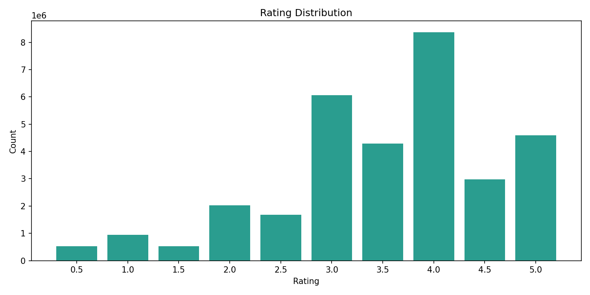
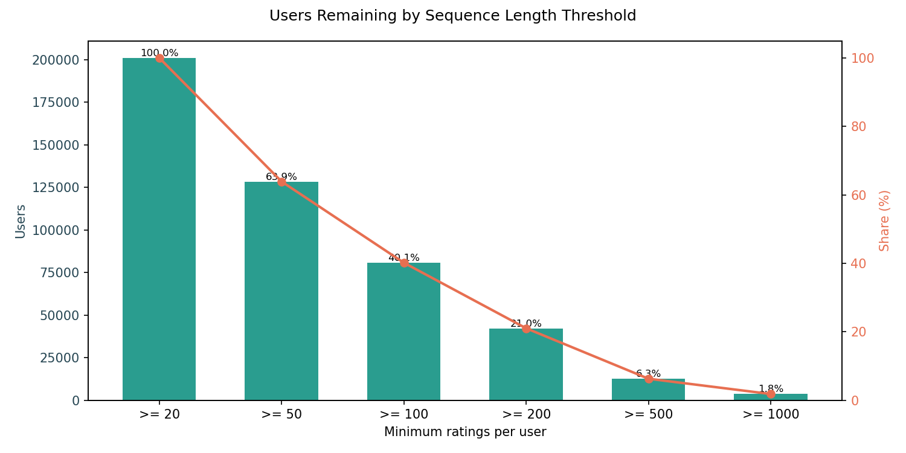
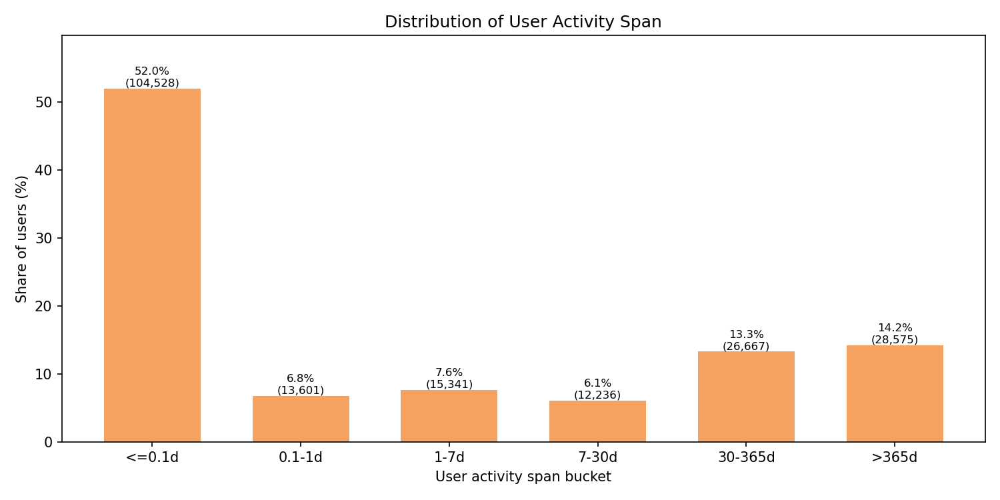
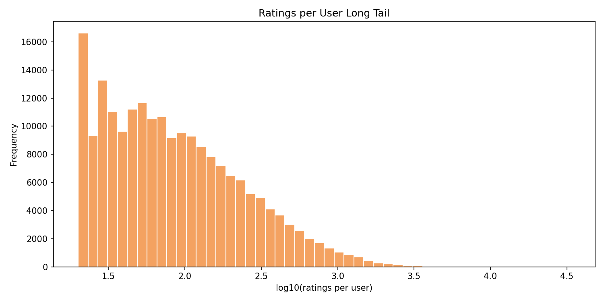
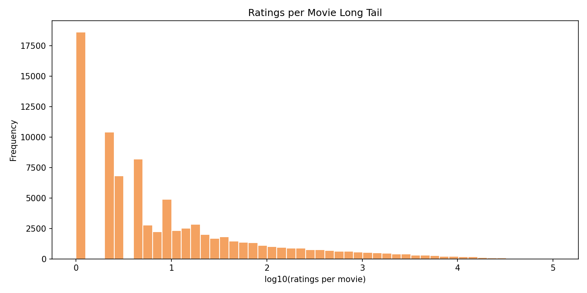
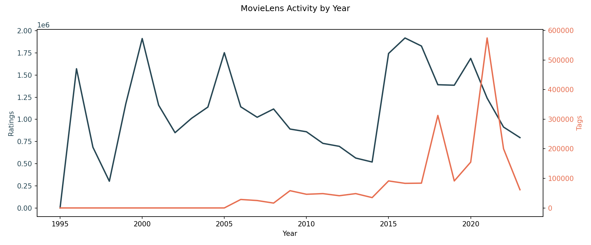

# MovieLens ml-32m EDA Report

Generated at: 2026-03-27 11:57:35

## Dataset Overview

| Metric | Value |
| --- | --- |
| Movies | 87,585 |
| Ratings | 32,000,204 |
| Tags | 2,000,072 |
| Users with ratings | 200,948 |
| Users with tags | 15,848 |
| Movies with tags | 51,323 |
| User-movie matrix density | 0.1818% |
| Ratings date range | 1995-01-09 to 2023-10-13 |
| Tags date range | 2005-12-24 to 2023-10-12 |

## Data Quality Checks

| Check | Value |
| --- | --- |
| Duplicate movieId rows in movies.csv | 0 |
| Duplicate movieId rows in links.csv | 0 |
| Movie titles without release year pattern | 617 |
| Movies with '(no genres listed)' | 7,080 |
| Links missing imdbId | 0 |
| Links missing tmdbId | 124 |
| Repeated consecutive userId-movieId pairs in ratings.csv | 0 |
| Blank normalized tags | 6 |

## Ratings Distribution

| Rating | Count | Share |
| --- | --- | --- |
| 0.5 | 525,132 | 1.64% |
| 1.0 | 946,675 | 2.96% |
| 1.5 | 531,063 | 1.66% |
| 2.0 | 2,028,622 | 6.34% |
| 2.5 | 1,685,386 | 5.27% |
| 3.0 | 6,054,990 | 18.92% |
| 3.5 | 4,290,105 | 13.41% |
| 4.0 | 8,367,654 | 26.15% |
| 4.5 | 2,974,000 | 9.29% |
| 5.0 | 4,596,577 | 14.36% |

## User Activity

| Statistic | Ratings per user |
| --- | --- |
| min | 20 |
| p25 | 36 |
| median | 73 |
| p75 | 167 |
| p90 | 364 |
| p99 | 1,290 |
| max | 33,332 |
| mean | 159 |

| Threshold | Users | Share |
| --- | --- | --- |
| >= 20 ratings | 200,948 | 100.00% |
| >= 50 ratings | 128,344 | 63.87% |
| >= 100 ratings | 80,675 | 40.15% |
| >= 200 ratings | 42,197 | 21.00% |
| >= 500 ratings | 12,603 | 6.27% |
| >= 1,000 ratings | 3,621 | 1.80% |

| Statistic | User activity span (days) |
| --- | --- |
| min | 0.0 |
| p25 | 0.0 |
| median | 0.1 |
| p75 | 53.1 |
| p90 | 709.0 |
| p99 | 4434.7 |
| max | 9515.1 |
| mean | 259.1 |

| Span bucket | Users | Share |
| --- | --- | --- |
| <= 0.1 days | 104,528 | 52.02% |
| 0.1-1 days | 13,601 | 6.77% |
| 1-7 days | 15,341 | 7.63% |
| 7-30 days | 12,236 | 6.09% |
| 30-365 days | 26,667 | 13.27% |
| > 365 days | 28,575 | 14.22% |

| User filter | Users | Median span (days) | Mean span (days) |
| --- | --- | --- | --- |
| >= 20 ratings | 200,948 | 0.1 | 259.1 |
| >= 50 ratings | 128,344 | 2.9 | 385.4 |
| >= 100 ratings | 80,675 | 26.9 | 558.7 |
| >= 200 ratings | 42,197 | 177.9 | 874.6 |
| >= 500 ratings | 12,603 | 823.9 | 1613.4 |
| >= 1,000 ratings | 3,621 | 1769.2 | 2416.0 |

| userId | Sequence length | Span (days) | First rating | Last rating |
| --- | --- | --- | --- | --- |
| 175325 | 33,332 | 1641.4 | 2015-12-15 | 2020-06-12 |
| 17035 | 9,577 | 3955.4 | 2012-12-13 | 2023-10-12 |
| 55653 | 9,178 | 5254.1 | 2001-08-05 | 2015-12-24 |
| 123465 | 9,044 | 4701.6 | 2010-11-28 | 2023-10-12 |
| 171795 | 9,016 | 4288.9 | 2009-04-07 | 2021-01-03 |
| 10202 | 7,748 | 8065.8 | 2001-09-10 | 2023-10-11 |
| 198515 | 7,594 | 7769.8 | 2002-07-05 | 2023-10-13 |
| 49305 | 7,488 | 3047.0 | 2006-10-10 | 2015-02-12 |
| 22744 | 7,372 | 660.5 | 2019-03-26 | 2021-01-15 |
| 7858 | 7,322 | 8587.5 | 2000-04-07 | 2023-10-12 |

| Statistic | Tags per tagging user |
| --- | --- |
| min | 1 |
| p25 | 2 |
| median | 5 |
| p75 | 25 |
| p90 | 118 |
| p99 | 1,332 |
| max | 723,473 |
| mean | 126 |

## Movie Popularity

| Statistic | Ratings per movie |
| --- | --- |
| min | 1 |
| p25 | 2 |
| median | 5 |
| p75 | 25 |
| p90 | 249 |
| p99 | 9,263 |
| max | 102,929 |
| mean | 379 |

| movieId | Title | Ratings | Average rating |
| --- | --- | --- | --- |
| 318 | Shawshank Redemption, The (1994) | 102,929 | 4.405 |
| 356 | Forrest Gump (1994) | 100,296 | 4.053 |
| 296 | Pulp Fiction (1994) | 98,409 | 4.197 |
| 2571 | Matrix, The (1999) | 93,808 | 4.156 |
| 593 | Silence of the Lambs, The (1991) | 90,330 | 4.148 |
| 260 | Star Wars: Episode IV - A New Hope (1977) | 85,010 | 4.100 |
| 2959 | Fight Club (1999) | 77,332 | 4.229 |
| 480 | Jurassic Park (1993) | 75,233 | 3.699 |
| 527 | Schindler's List (1993) | 73,849 | 4.237 |
| 4993 | Lord of the Rings: The Fellowship of the Ring, The (2001) | 73,122 | 4.092 |

### Highest Rated Movies with at Least 1,000 Ratings

| movieId | Title | Ratings | Average rating |
| --- | --- | --- | --- |
| 171011 | Planet Earth II (2016) | 1,956 | 4.447 |
| 159817 | Planet Earth (2006) | 2,948 | 4.444 |
| 170705 | Band of Brothers (2001) | 2,811 | 4.427 |
| 318 | Shawshank Redemption, The (1994) | 102,929 | 4.405 |
| 858 | Godfather, The (1972) | 66,440 | 4.317 |
| 202439 | Parasite (2019) | 11,670 | 4.312 |
| 179135 | Blue Planet II (2017) | 1,163 | 4.300 |
| 198185 | Twin Peaks (1989) | 1,140 | 4.299 |
| 1203 | 12 Angry Men (1957) | 21,863 | 4.265 |
| 50 | Usual Suspects, The (1995) | 67,750 | 4.265 |

### Most Tagged Movies

| movieId | Title | Tags |
| --- | --- | --- |
| 296 | Pulp Fiction (1994) | 6,697 |
| 79132 | Inception (2010) | 6,568 |
| 260 | Star Wars: Episode IV - A New Hope (1977) | 6,519 |
| 2571 | Matrix, The (1999) | 5,722 |
| 2959 | Fight Club (1999) | 5,532 |
| 109487 | Interstellar (2014) | 5,477 |
| 318 | Shawshank Redemption, The (1994) | 4,892 |
| 4226 | Memento (2000) | 3,808 |
| 7361 | Eternal Sunshine of the Spotless Mind (2004) | 3,683 |
| 356 | Forrest Gump (1994) | 3,581 |

## Long-Tail Concentration

| Movie bucket | Movies | Share of movies |
| --- | --- | --- |
| <= 1 ratings | 18,607 | 22.04% |
| <= 2 ratings | 29,012 | 34.36% |
| <= 5 ratings | 44,027 | 52.14% |
| <= 10 ratings | 53,911 | 63.85% |
| <= 20 ratings | 61,574 | 72.93% |
| <= 50 ratings | 68,549 | 81.19% |
| <= 100 ratings | 72,287 | 85.62% |

| Head bucket | Coverage | Share of all ratings |
| --- | --- | --- |
| Top 1% movies | 845 / 84,432 | 54.88% |
| Top 5% movies | 4,222 / 84,432 | 88.58% |
| Top 10% movies | 8,444 / 84,432 | 95.70% |

| Heavy-user bucket | Coverage | Share of all ratings |
| --- | --- | --- |
| Top 1% users | 2,010 / 200,948 | 12.57% |
| Top 5% users | 10,048 / 200,948 | 33.02% |
| Top 10% users | 20,095 / 200,948 | 47.20% |

## Genres

| Genre | Movies | Share of movies |
| --- | --- | --- |
| Drama | 34,175 | 39.02% |
| Comedy | 23,124 | 26.40% |
| Thriller | 11,823 | 13.50% |
| Romance | 10,369 | 11.84% |
| Action | 9,668 | 11.04% |
| Documentary | 9,363 | 10.69% |
| Horror | 8,654 | 9.88% |
| (no genres listed) | 7,080 | 8.08% |
| Crime | 6,976 | 7.96% |
| Adventure | 5,402 | 6.17% |
| Sci-Fi | 4,907 | 5.60% |
| Animation | 4,617 | 5.27% |
| Children | 4,520 | 5.16% |
| Mystery | 4,013 | 4.58% |
| Fantasy | 3,851 | 4.40% |

| Genre | Ratings | Average rating |
| --- | --- | --- |
| Drama | 13,973,271 | 3.682 |
| Comedy | 11,206,926 | 3.432 |
| Action | 9,665,213 | 3.476 |
| Thriller | 8,679,464 | 3.532 |
| Adventure | 7,590,522 | 3.523 |
| Sci-Fi | 5,717,337 | 3.492 |
| Romance | 5,524,615 | 3.545 |
| Crime | 5,373,051 | 3.692 |
| Fantasy | 3,702,759 | 3.512 |
| Children | 2,731,841 | 3.439 |
| Mystery | 2,615,322 | 3.673 |
| Horror | 2,492,315 | 3.307 |
| Animation | 2,214,562 | 3.615 |
| War | 1,594,110 | 3.792 |
| IMAX | 1,494,179 | 3.593 |

## Tags

| Tag | Count | Share |
| --- | --- | --- |
| sci-fi | 11,457 | 0.57% |
| atmospheric | 10,088 | 0.50% |
| action | 9,344 | 0.47% |
| comedy | 9,275 | 0.46% |
| funny | 8,088 | 0.40% |
| surreal | 7,480 | 0.37% |
| visually appealing | 7,253 | 0.36% |
| based on a book | 6,734 | 0.34% |
| twist ending | 6,600 | 0.33% |
| romance | 6,229 | 0.31% |
| dark comedy | 6,153 | 0.31% |
| thought-provoking | 6,003 | 0.30% |
| dystopia | 5,713 | 0.29% |
| violence | 5,483 | 0.27% |
| cinematography | 5,429 | 0.27% |

## Temporal Activity

| Year | Ratings | Tags |
| --- | --- | --- |
| 1995 | 4 | 0 |
| 1996 | 1,571,368 | 0 |
| 1997 | 685,388 | 0 |
| 1998 | 301,691 | 0 |
| 1999 | 1,174,629 | 0 |
| 2000 | 1,912,322 | 0 |
| 2001 | 1,160,098 | 0 |
| 2002 | 849,762 | 0 |
| 2003 | 1,011,000 | 0 |
| 2004 | 1,139,068 | 0 |
| 2005 | 1,752,573 | 27 |
| 2006 | 1,141,704 | 28,624 |
| 2007 | 1,023,813 | 25,054 |
| 2008 | 1,117,071 | 16,431 |
| 2009 | 890,696 | 58,309 |
| 2010 | 860,073 | 46,194 |
| 2011 | 729,301 | 48,422 |
| 2012 | 695,493 | 41,255 |
| 2013 | 563,301 | 48,440 |
| 2014 | 518,537 | 34,961 |
| 2015 | 1,743,866 | 91,287 |
| 2016 | 1,918,739 | 83,132 |
| 2017 | 1,827,953 | 83,741 |
| 2018 | 1,391,057 | 312,545 |
| 2019 | 1,385,467 | 91,275 |
| 2020 | 1,688,159 | 154,746 |
| 2021 | 1,239,912 | 574,212 |
| 2022 | 913,105 | 199,927 |
| 2023 | 794,054 | 61,490 |

